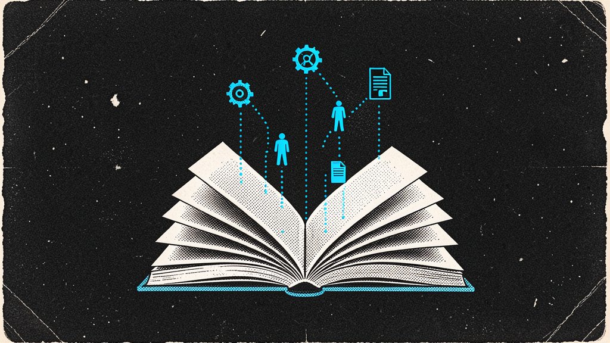
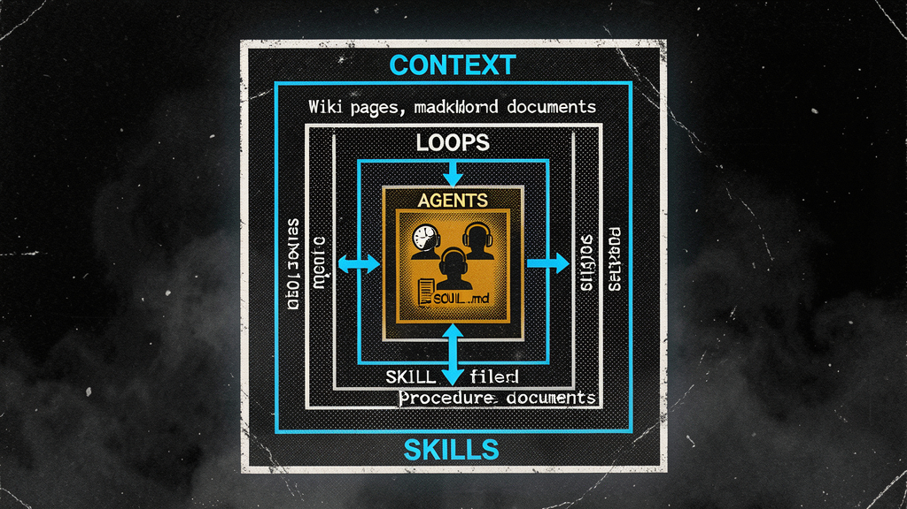
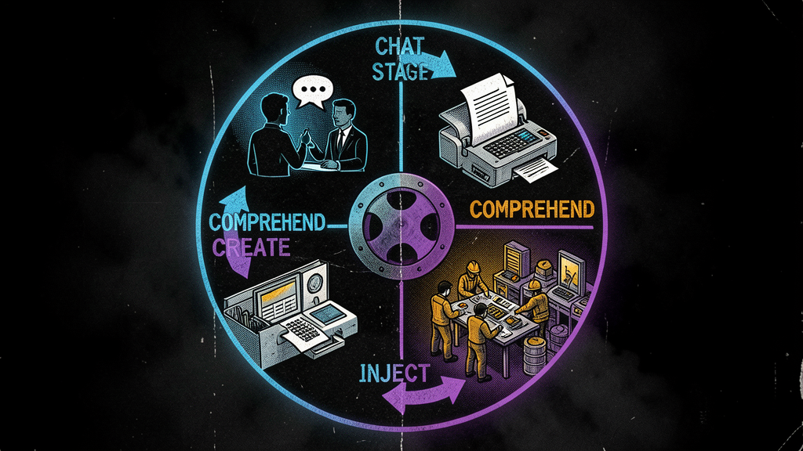
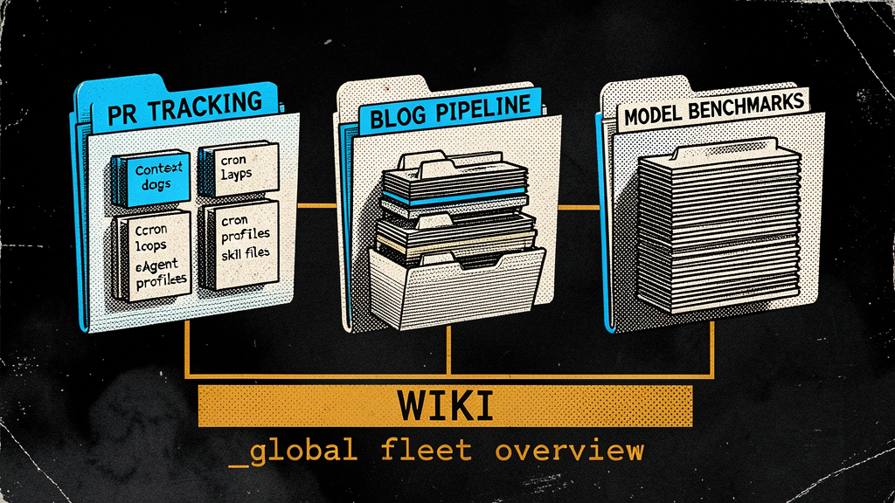
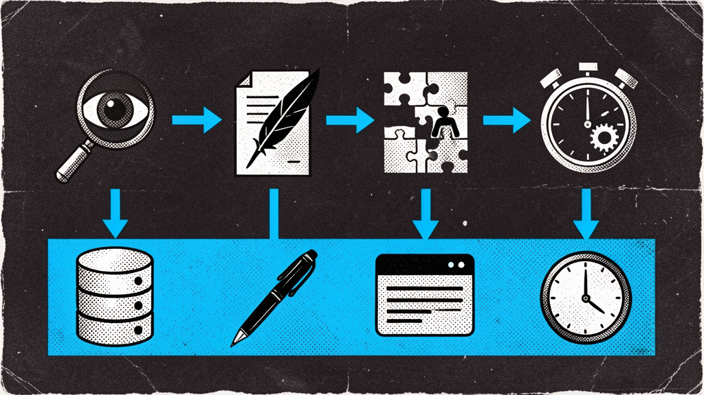

# Agent Wiki

> **A self-documenting, self-extending multi-agent system. The wiki IS the coordination layer.**
>
> Built on [Hermes Agent](https://github.com/NousResearch/hermes-agent) by [Nous Research](https://nousresearch.com).
> Topics are miniature GOOP instances. Markdown is the API between human and machine.

---

## What is Agent Wiki?

Agent Wiki organizes a multi-agent AI fleet as **a well-organized markdown vault**. Every topic you care about gets its own directory containing the full stack:

- **Context** — what the system understands about your goal
- **Loops** — cron jobs and workflows that run over time
- **Agents** — AI profiles that do the work
- **Skills** — reusable procedures agents load on demand

You chat with a friendly front-door agent. The system watches your conversations, comprehends what you want, and automatically creates the agents, skills, and workflows to make it happen. Progress flows back to you naturally in conversation.

**Every part of the system is a markdown file you can edit.** No config dashboards. No YAML wizards. Open the wiki, change what you want, and the system picks it up.

---

## Quick Start

```bash
# Clone the wiki
git clone https://github.com/SouthpawIN/agent-wiki.git ~/.hermes/wiki

# Set up the front-door agent (chat surface)
hermes profile create nous-girl
hermes -p nous-girl config set agent.toolsets "[]"

# Start the factory crons
hermes cron create "every 30m" --name "context-factory" --prompt "..."
hermes cron create "every 15m" --name "skills-factory" --prompt "..."
hermes cron create "every 15m" --name "agents-factory" --prompt "..."
hermes cron create "every 15m" --name "loops-factory" --prompt "..."

# Start chatting
hermes -p nous-girl --tui
```

→ Full setup: [[spec|Agent Wiki Specification]]

---

## The Four Primitives



| Primitive | Factory | What It Is |
|---|---|---|
| **Context** | Context | Wiki pages — raw understanding from chat, structured into knowledge |
| **Loops** | Loops | Cron jobs, kanban tasks — execution that runs over time |
| **Agents** | Agents | Hermes profiles — named entities with personality, tools, and skills |
| **Skills** | Skills | SKILL.md bundles — reusable procedures loaded on demand |

Primitives nest: **Context** contains **Loops** which invoke **Agents** which load **Skills**.

---

## The Flywheel



From idea to working system — driven entirely by markdown reads and writes:

1. **Chat** — You tell Nous Girl about an idea
2. **Comprehend** — Context reads the chat, writes wiki pages
3. **Create** — Factories (Skills, Agents, Loops) build skills, agents, and loops
4. **Inject** — Status flows back to Nous Girl, who tells you what happened

---

## Topic Structure



Every user interest is a self-contained **topic** — its own directory with the full GOOP stack:

```
wiki/topics/<topic>/
├── README.md              ← human dashboard
├── .system/               ← machine coordination (hidden)
│   ├── continuity.md      ← raw understanding
│   ├── injections.md       ← messages for Nous Girl
│   └── queue.md           ← pending factory work
├── skills/                ← skills for this topic
├── agents/                ← agents serving this topic
└── loops/                 ← execution infrastructure
```

The `.system/` prefix hides machine internals. You CAN open them — that's the debugger. But your default experience is clean markdown dashboards.

---

## The Factory Pipeline



Four cron jobs run the system. Each watches the wiki for signals and spawns work:

| Factory | Watches | Produces | Uses |
|---|---|---|---|
| **Context** | Chat sessions | Wiki pages, queue items | `session_search()`, `write_file()` |
| **Skills** | `[SKILLS]` queue items | SKILL.md files | `delegate_task()`, `skill_manage()` |
| **Agents** | `[AGENTS]` queue items | Agent profiles | `delegate_task()`, `hermes profile create` |
| **Loops** | `[LOOPS]` queue items | Cron jobs, kanban | `delegate_task()`, `cronjob()` |

All factories use **the same 4-stage pipeline**: Collect evidence → Generate candidates → Evaluate → Apply.

---

## Global Catalogs

See everything at a glance. Edit anything directly:

| Catalog | Shows |
|---|---|
| [[catalogs/fleet-dashboard|Fleet Dashboard]] | All topics, agents, skills, loops |
| [[catalogs/agent-roster|Agent Roster]] | Every agent → click to see SOUL, edit to change |
| [[catalogs/skill-registry|Skill Registry]] | Every skill → click to see SKILL.md |
| [[catalogs/loop-registry|Loop Registry]] | Every loop → edit schedule, pause |
| [[catalogs/topic-index|Topic Index]] | Every topic with full GOOP stack |

---

## Design Principles

1. **Markdown is the API** — human ↔ machine, machine ↔ machine
2. **The wiki is the system** — no separate database or config dashboard
3. **User-editable everything** — every understanding, queue item, status
4. **Dot-prefix for machine internals** — `.system/` is hidden but accessible
5. **Topics are self-contained** — each topic holds its own full GOOP stack
6. **Factories are thin** — cron jobs that spawn one `delegate_task`
7. **Injections keep you in the loop** — factories write to files, Nous Girl reads them
8. **No self-edit** — factories cannot modify themselves

---

## Learn More

- [[spec|Agent Wiki Specification]] — full architecture, setup, comparison to GOOP v1
- [[goop-whitepaper|GOOP Whitepaper v1]] — the original architectural vision (July 2026)
- [[goop-nesting|GOOP Nesting]] — primitive nesting hierarchy

---

*Built on [Hermes Agent](https://github.com/NousResearch/hermes-agent). Towards Self-Improvement.*
